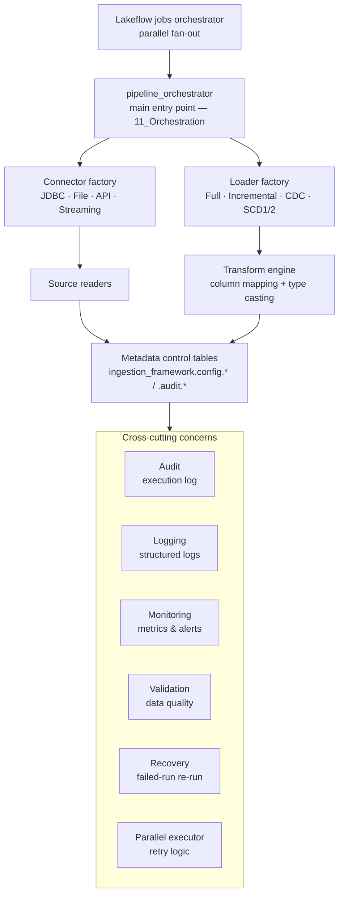

# Architecture

**Flow:** A Lakeflow job triggers `pipeline_orchestrator`, the single entry point for every pipeline. It reads one row from the `pipeline_config` metadata table to decide *which* connector and loader to use — no per-table code. Data flows source → connector → reader → transform engine → target table, while audit, logging, monitoring, validation, and recovery wrap every run.
